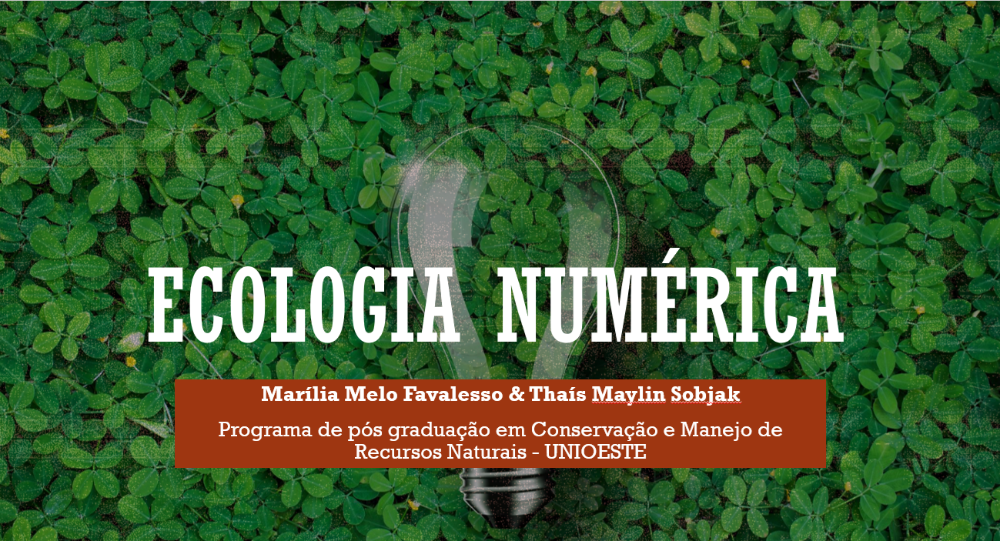

# **Minicurso de Ecologia Numérica**



## Sobre o Minicurso

Em 2016, ministrei, em parceria com minha querida colega Thais Sobjak, um minicurso de Ecologia Numérica para os graduandos de Ciências Biológicas da Universidade Estadual do Oeste do Paraná (UNIOESTE). O curso apresentou conceitos e práticas de PCA, clusterização e índices de diversidade ecológica.

## Requisitos

Para seguir este minicurso, é necessário ter o R instalado em seu computador. 

## Instalação dos Pacotes Necessários

Para garantir que você tem todos os pacotes necessários, execute o seguinte comando em seu console R:

```r
install.packages(c("vegan", "ggfortify", "psych", "MVN", "Hotelling"))
```

## Estrutura do Repositório

O minicurso está organizado em três dias, cada um focando em um tema específico:

```
minicurso-ecologia-numerica/
├── dia1/
│   ├── pca.pdf
│   └── pca.R
├── dia2/
│   ├── cluster.pdf
│   └── cluster.R
└── dia3/
    ├── indices.pdf
    └── indices.R
```

## Como Utilizar Este Repositório

1. **Clone o repositório**:
    ```sh
    git clone https://github.com/seu-usuario/minicurso-ecologia-numerica.git
    ```
2. **Instale os pacotes necessários**:
    ```r
    install.packages(c("vegan", "ggfortify", "psych", "MVN", "psych", "MVN"))
    ```
3. **Navegue pelos diretórios** para acessar as apresentações em PDF e scripts R correspondentes a cada dia do minicurso.

## Autoras

[Marília Melo Favalesso](https://www.mmfava.com) <br>
Thais Sobjak

## Licença

MIT License - [veja o arquivo](LICENSE) para mais detalhes.

## Agradecimentos

Agradecemos a todos os participantes do minicurso e à UNIOESTE pela oportunidade.


